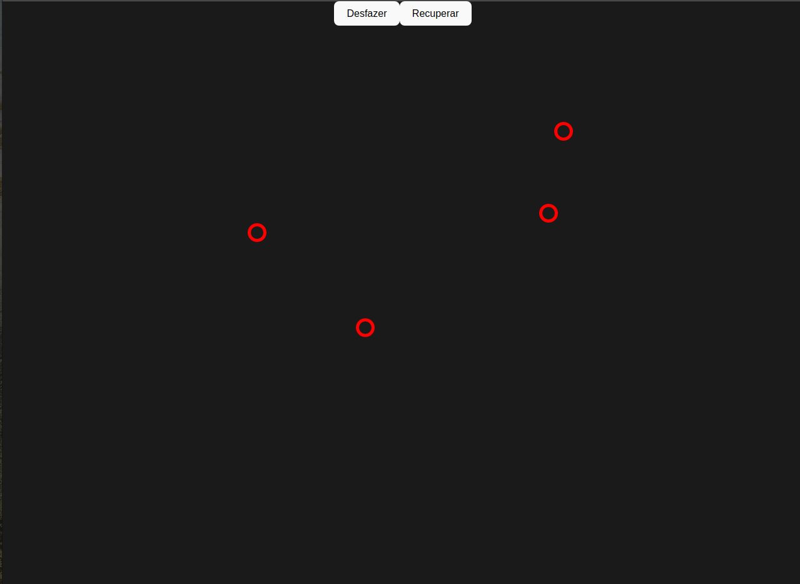

  <a href="#-tecnologias">Tecnologias</a>&nbsp;&nbsp;&nbsp;|&nbsp;&nbsp;&nbsp;
  <a href="#-projeto">Projeto</a>&nbsp;&nbsp;&nbsp;|&nbsp;&nbsp;&nbsp;
  <a href="#-como-rodar">Como rodar</a>&nbsp;&nbsp;&nbsp;|&nbsp;&nbsp;&nbsp;
  <a href="#-como-contribuir">Como contribuir</a>&nbsp;&nbsp;&nbsp;
  

 

  

## Click Point React TypeScript

## 🚀 Tecnologias

Esse projeto foi desenvolvido com as seguintes tecnologias:

- [React](https://pt-br.reactjs.org/docs/getting-started.html)
- [Yarn](https://yarnpkg.com/) - 1.22.4
- [Npm](https://www.npmjs.com/) - 6.14.5

## 💻 Projeto
Esse projeto é um desafio em React com TypeScript onde é preciso fazer uma aplicação em que cada clique gere um circulo na posição exata onde foi clicado. Com um botão de "desfazer" que faz sumir o ultimo circulo e outro para "refazer" voltando o circulo que foi apagado.

Projeto do canal [Front Beginners](https://www.youtube.com/watch?v=dOsBtM2U018).

## 🚀 Como Rodar

- Clone o projeto.
- Entre na pasta do projeto e rode npm install (pode usar yarn install de acordo com a sua configuração).
- npm run dev para rodar o font (localhost:3000).

## 🤔 Como contribuir

- Faça um fork desse repositório;
- Cria uma branch com a sua feature: `git checkout -b minha-feature`;
- Faça commit das suas alterações: `git commit -m 'feat: Minha nova feature'`;
- Faça push para a sua branch: `git push origin minha-feature`.

Depois que o merge da sua pull request for feito, você pode deletar a sua branch.

## 📝 Licença

Esse projeto está sob a licença MIT.
